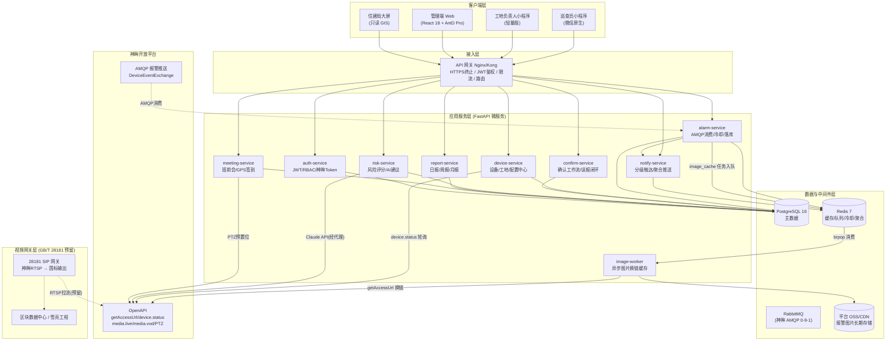
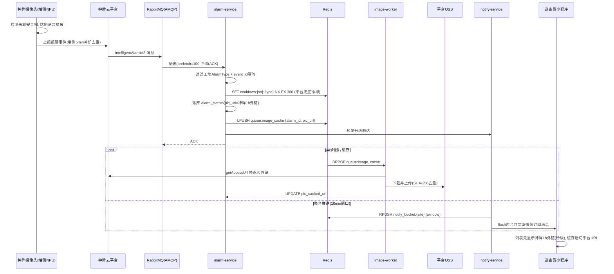

# 慧眼建安 WiseEye-JA · 系统架构总览

**文档定位**：面向研发人员的系统设计文档（System Design）· C 系列之 00
**项目**：龙岗区建筑工地 AI 智能监管平台（7000 路 AI 摄像头）
**版本**：v1.0 · 2026-06-22
**技术栈**：Python 3.11 + FastAPI + PostgreSQL 16 + Redis 7 + RabbitMQ（神眸 AMQP 0-9-1）+ 微信小程序 + React Web
**对接平台**：神眸开放平台（superacme OpenAPI / AMQP）

> 本文档与 04_系统实现设计.md（TDD）保持一致，神眸接口约定以 TDD 与神眸 OpenAPI 真实约定为准，不杜撰任何接口。

---

## 1. 架构设计目标与约束

### 1.1 设计目标

| 目标 | 量化指标（来自 SRD 非功能需求） | 架构落点 |
|------|------------------------------|---------|
| 高并发报警接入 | 7000 设备同时在线，1000 条/分钟报警处理，早高峰 08:00-09:00 波峰 | alarm-service 无状态水平扩展 + RabbitMQ 削峰 |
| 报警端到端时延 | AI 触发 → 小程序收到推送 ≤ 30 秒 | AMQP 实时消费 + 异步图片解耦 + 神眸 1 小时外链占位秒显 |
| 图片加载 | 小程序打开报警图片 ≤ 3 秒 | image-worker 异步缓存到平台 OSS/CDN，前端先用神眸原链占位 |
| 不丢消息 | 报警事件零丢失 | RabbitMQ 手动 ACK + 死信队列 + image-worker 幂等重试 |
| 可用性 | ≥ 99.5% | 服务多副本 + Redis/PostgreSQL 主从 + 消息持久化 |
| 数据隔离 | 街道用户只看本辖区数据 | 网关 JWT + 行级 street_id 过滤 |

### 1.2 关键架构约束

1. **微信小程序无长连接**：不能用 WebSocket 主动推送，实时触达只能走「微信订阅消息（服务通知）+ SMS 兜底」。
2. **神眸报警图片外链仅 1 小时有效**：必须由平台侧及时换取并缓存，否则历史报警图片失效（详见 03 号文档）。
3. **神眸 AMQP 队列为被动队列**：平台以 `passive=True` 声明已存在队列，不可自行新建 exchange/queue。
4. **境内访问 Claude API 需代理**：risk-service 调用 Anthropic API 需 HTTP_PROXY。
5. **7000 路规模下的查询性能**：报警表日增数十万行，必须有复合索引（P1-3）与分区策略。

---

## 2. 系统分层架构

### 2.1 总体分层（C4 Container 视角）

### 2.2 报警主链路时序（端到端 ≤ 30 秒）

---

## 3. 服务拆分

平台按「职责单一 + 早高峰可独立扩缩容」原则拆分为 9 个 FastAPI 服务。alarm-service 与 image-worker 的解耦是抗 7000 路并发的核心（评审 P0-3）。

| 服务 | 端口 | 核心职责 | 是否易成瓶颈 | 扩展策略 |
|------|------|---------|------------|---------|
| alarm-service | 8001 | AMQP 消费、event_id 幂等、平台兜底冷却、落库、入图片队列、触发通知 | 是（早高峰波峰） | 多副本竞争同一队列，prefetch 限流 |
| image-worker | 8009 | 消费 Redis 图片队列、调神眸 getAccessUrl 换链、下载上传平台 OSS、SHA-256 去重、失败重试 | 是（I/O 密集） | 独立水平扩展，与报警主链路解耦 |
| device-service | 8002 | 工地/设备/巡查员 CRUD、分组、**运营参数配置中心**、神眸 device.status 轮询、在线率监控 | 否 | 单/双副本 |
| confirm-service | 8003 | 确认违规/标记误报工作流、**误报→冷却延长闭环**、违规台账、SLA 超时升级 | 否 | 双副本 |
| notify-service | 8007 | 微信订阅消息、SMS 兜底、10min 聚合推送、催办、SLA 升级触达 | 中 | 双副本 + 限频 |
| risk-service | 8005 | 每日风险评分、Claude API 生成政策建议 | 否（定时批） | 单副本 + 定时锁 |
| report-service | 8004 | 日报/周报/月报生成、街道维度导出 | 否（定时批） | 单副本 |
| meeting-service | 8006 | 班前会发起、二维码、GPS≤50m 校验、PTZ 预置位抓拍 | 否 | 双副本 |
| auth-service | 8008 | JWT 发放/刷新、RBAC、街道数据隔离、神眸 outuser/auth 换 Token | 中 | 双副本 |

**部署形态**：初期 Docker Compose（政府项目可私有化），扩展期迁 K8s。alarm-service 与 image-worker 配置 HPA，按 RabbitMQ 队列堆积深度 / Redis 队列长度自动扩缩。

---

## 4. 技术选型理由

| 层次 | 选型 | 理由 | 备选与否决原因 |
|------|------|------|--------------|
| 后端语言/框架 | Python 3.11 + FastAPI | 异步原生（asyncio + aio_pika 消费 AMQP）；自动 OpenAPI/Swagger 便于与 BIM/中台对接；AI 集成生态好 | Go 吞吐更高但 AI/算法生态弱；本场景消息量未到需要 Go 的级别 |
| 关系库 | PostgreSQL 16 | JSONB 存评分明细/签到记录；强一致；分区表+复合索引应对报警大表；地理坐标可上 PostGIS | MySQL 的 JSON 能力与分区灵活性弱于 PG |
| 缓存/队列 | Redis 7 | 冷却去重（SET NX EX 原子）、10min 聚合桶、图片任务队列、Token 缓存、SHA-256 去重集合 | 多用途单组件，降低运维面 |
| 消息队列 | RabbitMQ（AMQP 0-9-1） | **神眸平台原生协议**，必须用；支持手动 ACK、死信队列、顺序性，契合报警「不丢消息」要求 | Kafka 高吞吐但本量级（千万级以下）无必要，且神眸不提供 Kafka 接入 |
| 图片存储 | 神眸 OSS（源）+ 平台 OSS/CDN（缓存） | 神眸外链仅 1 小时，必须缓存；平台 OSS 满足 ≥6 个月留存（SRD 4.2） | 直存神眸链接会导致历史图片失效 |
| 前端 Web | React 18 + Ant Design Pro + ECharts | 政务后台成熟，大屏 GIS + 图表能力强 | Vue 亦可，团队 React 储备更足 |
| 移动端 | 微信原生小程序 | 政务覆盖率最高、订阅消息能力强、无需装 App，适配年长巡查员 | uni-app 跨端但订阅消息/性能不如原生 |
| 大模型 | Claude API（claude-sonnet-4-6） | 生成政府公文风格政策建议，结构化 JSON 输出稳定 | 国产模型可作私有化备选 |
| 视频国标 | GB/T 28181-2022 网关（预留） | 对接区块数据中心/雪亮工程的合规要求（NFR-06） | 一期仅预留，二期落地 |

---

## 5. 关键架构决策记录（ADR 摘要）

| 编号 | 决策 | 背景 | 结论 |
|------|------|------|------|
| ADR-01 | 报警接收与图片缓存解耦 | 早高峰 08:00-09:00 图片换链/上传 I/O 重，若同步会阻塞报警落库 | image-worker 独立服务消费 Redis 队列，主链路只入队不等待（P0-2 异步） |
| ADR-02 | 双层冷却（端侧 5min + 平台 10min 聚合） | 7000 路若每路日触发多次，巡查员被轰炸 | 端侧设备级去重 + 平台 Redis 兜底冷却 + 聚合推送（P0-1 冷却） |
| ADR-03 | 图片幂等用 SHA-256 内容哈希 | Redis 队列网络抖动可能重复投递 | image-worker 以内容哈希判重，避免重复存储（P1 幂等） |
| ADR-04 | 运营参数下沉数据库配置中心 | 冷却/聚合窗口硬编码需重部署 | 新增 system_configs 表 + Web 可调（P1-6） |
| ADR-05 | 报警大表复合索引 + 月分区 | 7000 路日增数十万行，查询恶化 | (camera_id/sn, event_type, created_at) 复合索引 + 按月分区（P1-3） |
| ADR-06 | 实时触达走微信订阅消息 + SMS | 小程序无长连接 | 订阅消息为主，严重违规 SMS 兜底（NFR-04） |

---

## 6. 文档导航

| 文档 | 内容 |
|------|------|
| 00_架构总览.md | 本文：分层架构、服务拆分、技术选型、ADR |
| 01_后端设计.md | 服务模块详设、数据库表结构（字段+索引）、关键 API |
| 02_前端设计.md | 巡查员小程序 + Web 管理端页面/组件/状态/弱网降级 |
| 03_神眸开放平台接口对接.md | AMQP 消费、OSS 外链换取、设备轮询、PTZ（时序图+伪代码） |
| 04_评审改进项落地设计.md | P0/P1 逐条落地设计 |

---

*文档结束 · 慧眼建安 WiseEye-JA 架构总览 v1.0*
