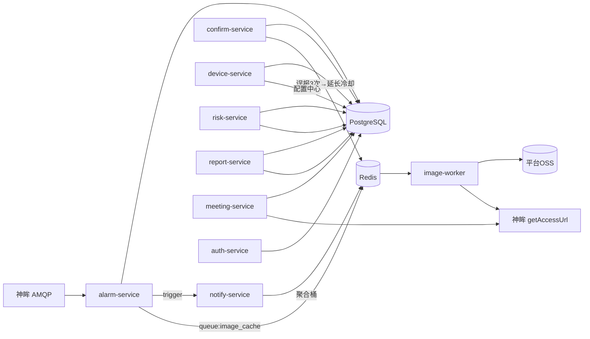

# 慧眼建安 WiseEye-JA · 后端设计

**文档定位**：面向研发人员的系统设计文档 · C 系列之 01
**版本**：v1.0 · 2026-06-22
**技术栈**：Python 3.11 + FastAPI + PostgreSQL 16 + Redis 7 + RabbitMQ（神眸 AMQP）

> 神眸接口约定（AMQP 0-9-1 / getAccessUrl 外链 / device.status / PTZ）以 04_系统实现设计.md 为准，详见本系列 03 号文档。

---

## 1. 服务模块总览

| 服务 | 端口 | 入口 | 关键依赖 |
|------|------|------|---------|
| alarm-service | 8001 | AMQP consumer + REST | RabbitMQ, Redis, PostgreSQL |
| image-worker | 8009 | Redis 队列 worker | Redis, 神眸 OpenAPI, 平台 OSS |
| device-service | 8002 | REST + 定时轮询 | PostgreSQL, 神眸 device.status |
| confirm-service | 8003 | REST | PostgreSQL, Redis（冷却延长） |
| notify-service | 8007 | REST + 定时 flush | Redis, 微信订阅消息, SMS |
| risk-service | 8005 | 定时批 | PostgreSQL, Claude API |
| report-service | 8004 | 定时批 + REST | PostgreSQL |
| meeting-service | 8006 | REST | PostgreSQL, 神眸 PTZ/media |
| auth-service | 8008 | REST | PostgreSQL, 微信, 神眸 outuser/auth |

### 1.1 模块依赖关系



---

## 2. alarm-service（报警核心服务）

### 2.1 职责

1. 以 `aio_pika` 消费神眸 AMQP `IntelligentAlarmV2` 消息（手动 ACK，prefetch=100）。
2. 过滤非工地 AlarmType（仅 `{20001,20002,20003,13001,10010,11005}`）。
3. `event_id` 唯一索引幂等去重。
4. **平台兜底冷却**：`SET cooldown:{sn}:{type} NX EX <动态TTL>`（默认 300s，可被误报闭环延长，见 04 文档 P1-1）。
5. 落库 `alarm_events`，`pic_url` 存神眸 1 小时外链供前端占位。
6. 入 `queue:image_cache` 队列交 image-worker 异步缓存。
7. 触发 notify-service 分级触达。

### 2.2 消费主流程（伪代码）

```python
# alarm_consumer.py
SITE_ALARM_TYPES = {20001, 20002, 20003, 13001, 10010, 11005}

async def on_alarm_message(message: aio_pika.IncomingMessage):
    async with message.process(requeue=True):   # 异常自动 requeue，不丢消息
        body = json.loads(message.body)
        if body.get("identifier") != "IntelligentAlarmV2":
            return
        for alarm in body["value"]["AlarmList"]:
            await process_alarm(
                sn=body["deviceSn"],
                event_id=alarm["EventID"],
                alarm_type=int(alarm["AlarmType"]),
                alarm_time=parse_event_time(alarm["EventID"]),
                pic_url=alarm.get("Pic", {}).get("Url"),
            )

async def process_alarm(sn, event_id, alarm_type, alarm_time, pic_url):
    if alarm_type not in SITE_ALARM_TYPES:
        return
    if await db.fetchval("SELECT 1 FROM alarm_events WHERE event_id=$1", event_id):
        return  # 幂等

    # 平台兜底冷却：TTL 从配置中心读取，误报闭环可临时拉长（见 04 文档）
    ttl = await get_cooldown_ttl(sn, alarm_type)        # 默认 300s
    is_new = await redis.set(f"cooldown:{sn}:{alarm_type}", 1, nx=True, ex=ttl)

    site = await db.fetchrow(
        "SELECT s.id, s.name FROM sites s JOIN devices d ON d.site_id=s.id WHERE d.sn=$1", sn)
    if not site:
        return

    alarm_id = await db.fetchval(
        """INSERT INTO alarm_events(sn,event_id,event_type,alarm_time,pic_url,site_id,notify_suppressed)
           VALUES($1,$2,$3,$4,$5,$6,$7) ON CONFLICT(event_id) DO NOTHING RETURNING id""",
        sn, event_id, alarm_type, alarm_time, pic_url, site["id"], (not is_new))
    if alarm_id is None:
        return

    # 异步图片缓存（解耦，主链路不等待）
    await redis.lpush("queue:image_cache",
                      json.dumps({"alarm_id": alarm_id, "pic_url": pic_url}))

    # 冷却期内仍落库但不推送，阻断骚扰
    if is_new:
        await trigger_notify(alarm_id, site["id"], alarm_type)
```

### 2.3 关键 API

| 方法 | 路径 | 说明 |
|------|------|------|
| GET | /api/v1/alarms | 报警列表（status/site_id/event_type/时间范围 过滤，分页） |
| GET | /api/v1/alarms/{id} | 报警详情（含 pic_cached_url，空则回退 pic_url） |
| GET | /api/v1/alarms/stats | 报警统计（按类型/时间聚合） |
| GET | /api/v1/alarms/{id}/evidence | AI 证据链：前后 30s 视频片段 + 截图（P1-5） |

---

## 3. image-worker（异步图片缓存服务）— P0-2 核心

### 3.1 职责与解耦理由

早高峰报警密集，图片「换链 + 下载 + 上传」是 I/O 重操作，必须与报警落库主链路解耦。image-worker 独立进程消费 `queue:image_cache`，可独立水平扩展。前端在 `pic_cached_url` 为空时使用神眸 1 小时外链 `pic_url` 占位，实现秒级显示。

### 3.2 幂等设计（SHA-256 内容去重）— P1 幂等

Redis 网络抖动可能重复投递。worker 下载图片后计算 SHA-256，以哈希作为 OSS object key 主体，同哈希直接复用已存对象，保证幂等：

```python
# image_worker.py
async def image_worker_loop():
    while True:
        item = await redis.brpop("queue:image_cache", timeout=5)
        if not item:
            continue
        task = json.loads(item[1])
        alarm_id, pic_url = task["alarm_id"], task["pic_url"]
        try:
            # 1) 调神眸 OpenAPI 换有效外链（神眸原链 1h 有效）
            access_url = await shenmou.get_access_url(pic_url)
            # 2) 下载
            content = await http.get_bytes(access_url)
            # 3) SHA-256 内容去重
            digest = hashlib.sha256(content).hexdigest()
            if await redis.sismember("img:hashes", digest):
                cached_url = await redis.hget("img:hash2url", digest)
            else:
                cached_url = await oss.put(f"alarms/{digest}.jpg", content, "image/jpeg")
                await redis.sadd("img:hashes", digest)
                await redis.hset("img:hash2url", digest, cached_url)
            # 4) 回写
            await db.execute(
                "UPDATE alarm_events SET pic_cached_url=$1, pic_sha256=$2 WHERE id=$3",
                cached_url, digest, alarm_id)
        except Exception as e:
            logger.warning(f"image_worker alarm {alarm_id} 失败，重试入队: {e}")
            await redis.lpush("queue:image_cache_retry", item[1])
```

死信处理：`queue:image_cache_retry` 由独立延迟重试 worker 回灌主队列，超过 N 次进 `queue:image_cache_dead` 告警。

---

## 4. device-service（设备/配置中心）

### 4.1 职责

- 工地/设备/巡查员 CRUD 与三级（街道/社区/工地）分组。
- 定时轮询神眸 `device.status` 更新在线状态（详见 03 文档）。
- **运营参数配置中心**（P1-6）：冷却 TTL、聚合窗口、静音时段、SLA 阈值、GPS 阈值等从 `system_configs` 读取，Web 可调，变更发 Redis pub/sub 通知各服务热加载。
- **摄像头在线率监控**（P1-4）：离线超 2h 推送街道联系人。

### 4.2 关键 API

| 方法 | 路径 | 说明 |
|------|------|------|
| GET/POST | /api/v1/sites | 工地列表/新建（街道/风险等级过滤） |
| GET | /api/v1/sites/{id} | 工地详情（设备/风险分/近期报警） |
| POST | /api/v1/sites/import | Excel 批量导入工地+设备绑定 |
| GET | /api/v1/devices | 设备列表（含在线状态） |
| GET | /api/v1/devices/{sn}/status | 设备在线状态（代理神眸） |
| GET/PUT | /api/v1/configs | 运营参数读取/更新（配置中心，仅管理员） |
| GET | /api/v1/monitor/offline | 离线超阈值设备列表 |

---

## 5. confirm-service（确认工作流 + 误报闭环）

- 确认违规 / 标记误报 + 备注，写违规台账。
- **误报→冷却延长闭环**（P1-1）：同一 sn 同类型累计误报达阈值（默认 3 次），将该 `(sn, event_type)` 冷却 TTL 临时上调（默认 1800s），写 `cooldown_overrides`，并将误报截图入「困难样本池」反哺算法。
- **SLA 超时升级**（评审 P0-2 关联）：普通报警 30min、严重报警 10min 未确认，notify-service 升级至科长。

| 方法 | 路径 | 说明 |
|------|------|------|
| POST | /api/v1/alarms/{id}/confirm | 确认违规 |
| POST | /api/v1/alarms/{id}/misjudge | 标记误报（触发误报闭环） |
| GET | /api/v1/alarms/sla/overdue | 超时未确认列表 |

---

## 6. 其余服务要点

- **risk-service**：每日 22:00 计算五维风险分（报警频次 30% / 严重度 25% / 整改率 20% / 班前会 15% / 在线率 10%），写 `risk_score_logs`；触发条件命中后调 Claude API 生成政策建议入 `ai_advices`。
- **report-service**：18:00 日报、周一 08:00 街道周报、月初月报；**街道维度一键导出 Excel/PDF**（评审街道办诉求）。
- **meeting-service**：班前会发起→生成二维码（1h 有效）→扫码签到（GPS≤50m 校验）→若 PTZ 设备则调神眸 PTZ 预置位抓拍留证（详见 03 文档）。
- **notify-service**：分级触达（一般→微信订阅消息；严重 20002→微信+SMS）；10min 聚合 flush；催办与 SLA 升级。
- **auth-service**：`wx.login` 换 openid 发 JWT（7 天）；RBAC + 街道 `street_id` 行级隔离；神眸 `outuser/auth` 换 Token 缓存。

---

## 7. 数据库设计（PostgreSQL 16）

### 7.1 完整建表 DDL（含字段与索引）

```sql
-- 街道
CREATE TABLE streets (
    id          SERIAL PRIMARY KEY,
    name        VARCHAR(50) NOT NULL,
    code        VARCHAR(20) UNIQUE,
    contact_name  VARCHAR(50),
    contact_phone VARCHAR(20),       -- 离线告警/周报联系人(P1-4)
    created_at  TIMESTAMPTZ DEFAULT NOW()
);

-- 施工企业
CREATE TABLE enterprises (
    id          SERIAL PRIMARY KEY,
    name        VARCHAR(100) NOT NULL,
    credit_code VARCHAR(30),
    contact     VARCHAR(50),
    phone       VARCHAR(20),
    risk_score  SMALLINT DEFAULT 0,
    created_at  TIMESTAMPTZ DEFAULT NOW()
);

-- 工地
CREATE TABLE sites (
    id              SERIAL PRIMARY KEY,
    name            VARCHAR(200) NOT NULL,
    address         VARCHAR(300),
    lng             DECIMAL(10,6),
    lat             DECIMAL(10,6),
    street_id       INTEGER REFERENCES streets(id),
    enterprise_id   INTEGER REFERENCES enterprises(id),
    status          VARCHAR(20) DEFAULT 'ACTIVE',     -- ACTIVE/PAUSED/CLOSED
    work_state      VARCHAR(20) DEFAULT 'WORKING',    -- WORKING/HOLIDAY/SUSPEND 停工开关(监管科诉求)
    risk_score      SMALLINT DEFAULT 0,
    risk_level      VARCHAR(10) DEFAULT 'GREEN',      -- RED/YELLOW/GREEN
    score_updated_at TIMESTAMPTZ,
    created_at      TIMESTAMPTZ DEFAULT NOW(),
    updated_at      TIMESTAMPTZ DEFAULT NOW()
);
CREATE INDEX idx_sites_street ON sites(street_id);
CREATE INDEX idx_sites_risk ON sites(risk_level, risk_score DESC);

-- 摄像头设备
CREATE TABLE devices (
    id              SERIAL PRIMARY KEY,
    sn              VARCHAR(50) UNIQUE NOT NULL,
    site_id         INTEGER REFERENCES sites(id),
    position_desc   VARCHAR(100),
    has_ptz         BOOLEAN DEFAULT FALSE,            -- 是否 PTZ 云台(班前会预置位)
    online_status   VARCHAR(10) DEFAULT 'OFFLINE',
    last_online_at  TIMESTAMPTZ,
    offline_notified_at TIMESTAMPTZ,                  -- 离线2h已通知时间(P1-4 防重复)
    created_at      TIMESTAMPTZ DEFAULT NOW()
);
CREATE INDEX idx_devices_site ON devices(site_id);
CREATE INDEX idx_devices_online ON devices(online_status, last_online_at);

-- 巡查员
CREATE TABLE inspectors (
    id          SERIAL PRIMARY KEY,
    name        VARCHAR(50) NOT NULL,
    phone       VARCHAR(20) UNIQUE NOT NULL,
    street_id   INTEGER REFERENCES streets(id),
    openid      VARCHAR(100) UNIQUE,
    active      BOOLEAN DEFAULT TRUE,
    created_at  TIMESTAMPTZ DEFAULT NOW()
);

CREATE TABLE site_inspectors (
    site_id         INTEGER REFERENCES sites(id),
    inspector_id    INTEGER REFERENCES inspectors(id),
    assigned_at     TIMESTAMPTZ DEFAULT NOW(),
    PRIMARY KEY (site_id, inspector_id)
);

-- 报警事件（按月分区，应对 7000 路日增数十万行）
CREATE TABLE alarm_events (
    id              BIGSERIAL,
    sn              VARCHAR(50) NOT NULL,            -- = camera_id（神眸设备SN）
    event_id        VARCHAR(100) NOT NULL,          -- 神眸 EventID，幂等去重
    event_type      INTEGER NOT NULL,               -- 20001/20002/20003/13001/10010/11005
    alarm_time      TIMESTAMPTZ NOT NULL,
    pic_url         TEXT,                            -- 神眸 OSS 外链(1小时有效)，前端占位
    pic_cached_url  TEXT,                            -- 平台 OSS 长期链接(image-worker回写)
    pic_sha256      CHAR(64),                        -- 内容去重指纹(P1 幂等)
    video_clip_url  TEXT,                            -- 前后30s视频片段(P1-5 证据链)
    site_id         INTEGER REFERENCES sites(id),
    confirm_status  VARCHAR(20) DEFAULT 'PENDING',   -- PENDING/CONFIRMED/MISJUDGE
    confirmed_by    INTEGER REFERENCES inspectors(id),
    confirmed_at    TIMESTAMPTZ,
    confirm_remark  VARCHAR(500),
    notify_suppressed BOOLEAN DEFAULT FALSE,         -- 冷却期内落库未推送
    notified_at     TIMESTAMPTZ,
    sla_escalated_at TIMESTAMPTZ,                    -- SLA 超时升级时间
    created_at      TIMESTAMPTZ DEFAULT NOW(),
    PRIMARY KEY (id, alarm_time)
) PARTITION BY RANGE (alarm_time);

-- 月分区示例
CREATE TABLE alarm_events_2026_06 PARTITION OF alarm_events
    FOR VALUES FROM ('2026-06-01') TO ('2026-07-01');

-- 幂等唯一索引
CREATE UNIQUE INDEX uq_alarm_event_id ON alarm_events(event_id, alarm_time);
-- P1-3 复合索引：camera_id(sn) + event_type + created_at(以 alarm_time 为时间维)
CREATE INDEX idx_alarm_camera_type_time
    ON alarm_events(sn, event_type, alarm_time DESC);
CREATE INDEX idx_alarm_site_time ON alarm_events(site_id, alarm_time DESC);
CREATE INDEX idx_alarm_status ON alarm_events(confirm_status, alarm_time DESC);

-- 班前会记录
CREATE TABLE safety_meetings (
    id                      BIGSERIAL PRIMARY KEY,
    site_id                 INTEGER REFERENCES sites(id),
    meeting_date            DATE NOT NULL,
    initiated_by            VARCHAR(50),
    initiated_at            TIMESTAMPTZ,
    pic_url                 TEXT,                    -- PTZ 预置位抓拍留证
    sign_records            JSONB,                   -- [{name,role,signed_at,lng,lat}]
    safety_officer_present  BOOLEAN DEFAULT FALSE,
    status                  VARCHAR(20) DEFAULT 'PENDING',  -- COMPLETE/INCOMPLETE/NO_MEETING
    created_at              TIMESTAMPTZ DEFAULT NOW(),
    UNIQUE(site_id, meeting_date)
);
CREATE INDEX idx_meeting_site_date ON safety_meetings(site_id, meeting_date DESC);

-- 风险评分日志
CREATE TABLE risk_score_logs (
    id          BIGSERIAL PRIMARY KEY,
    site_id     INTEGER REFERENCES sites(id),
    score_date  DATE NOT NULL,
    score       SMALLINT NOT NULL,
    level       VARCHAR(10) NOT NULL,
    detail      JSONB,
    created_at  TIMESTAMPTZ DEFAULT NOW(),
    UNIQUE(site_id, score_date)
);

-- AI 政策建议
CREATE TABLE ai_advices (
    id              BIGSERIAL PRIMARY KEY,
    target_type     VARCHAR(20) NOT NULL,            -- SITE/ENTERPRISE/STREET
    target_id       INTEGER NOT NULL,
    advice_title    VARCHAR(200) NOT NULL,
    advice_content  TEXT NOT NULL,
    trigger_reason  TEXT,
    urgency         VARCHAR(10) DEFAULT 'MEDIUM',
    status          VARCHAR(20) DEFAULT 'PENDING',
    generated_at    TIMESTAMPTZ DEFAULT NOW()
);

-- 运营参数配置中心（P1-6）
CREATE TABLE system_configs (
    key         VARCHAR(80) PRIMARY KEY,             -- cooldown.default_ttl 等
    value       JSONB NOT NULL,
    scope       VARCHAR(20) DEFAULT 'GLOBAL',        -- GLOBAL/SITE/ALG
    scope_id    INTEGER,
    description VARCHAR(200),
    updated_by  INTEGER,
    updated_at  TIMESTAMPTZ DEFAULT NOW()
);

-- 冷却覆盖表（误报闭环 P1-1）
CREATE TABLE cooldown_overrides (
    sn          VARCHAR(50) NOT NULL,
    event_type  INTEGER NOT NULL,
    ttl_seconds INTEGER NOT NULL,                    -- 临时延长后的冷却秒数
    reason      VARCHAR(100),                        -- 'MISJUDGE_3_TIMES'
    expires_at  TIMESTAMPTZ,
    created_at  TIMESTAMPTZ DEFAULT NOW(),
    PRIMARY KEY (sn, event_type)
);

-- 误报困难样本池（反哺算法）
CREATE TABLE misjudge_samples (
    id          BIGSERIAL PRIMARY KEY,
    alarm_id    BIGINT NOT NULL,
    sn          VARCHAR(50),
    event_type  INTEGER,
    pic_url     TEXT,
    marked_by   INTEGER,
    created_at  TIMESTAMPTZ DEFAULT NOW()
);

-- 操作日志（安全需求：管理员操作保留1年）
CREATE TABLE audit_logs (
    id          BIGSERIAL PRIMARY KEY,
    actor_id    INTEGER,
    action      VARCHAR(80),
    target      VARCHAR(120),
    detail      JSONB,
    ip          INET,
    created_at  TIMESTAMPTZ DEFAULT NOW()
);
CREATE INDEX idx_audit_actor_time ON audit_logs(actor_id, created_at DESC);

-- 二期积分预埋（评审运营专家建议）
CREATE TABLE score_events (
    id          BIGSERIAL PRIMARY KEY,
    target_type VARCHAR(20),
    target_id   INTEGER,
    delta       SMALLINT,
    reason      VARCHAR(120),
    created_at  TIMESTAMPTZ DEFAULT NOW()
);
```

### 7.2 索引设计说明（EXPLAIN ANALYZE 验证点）

| 查询路径 | 命中索引 |
|---------|---------|
| 单摄像头某类型近期报警（误报闭环计数、详情页关联信息） | idx_alarm_camera_type_time |
| 工地报警历史/日报 | idx_alarm_site_time |
| 待确认列表/SLA 扫描 | idx_alarm_status |
| 离线设备扫描（P1-4） | idx_devices_online |
| event_id 幂等去重 | uq_alarm_event_id |

按月 RANGE 分区 + 复合索引，使热点查询只扫当月分区，避免随历史数据增长而恶化。

---

## 8. 统一接口规范

**响应格式**：
```json
{ "code": 0, "message": "success", "data": {}, "timestamp": 1719043200000 }
```

**分页**：`{ "items": [], "total": 0, "page": 1, "page_size": 20, "has_more": false }`

**错误码**：0 成功 / 1001 未授权 / 1002 权限不足 / 1003 资源不存在 / 1004 参数错误 / 2001 已处理 / 2002 班前会已存在。

**鉴权**：`Authorization: Bearer <JWT>`；街道用户请求自动注入 `street_id` 行级过滤。

---

*文档结束 · 慧眼建安 WiseEye-JA 后端设计 v1.0*
