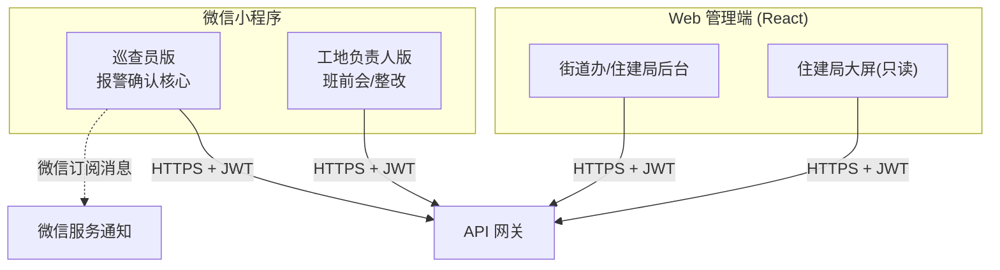

# 慧眼建安 WiseEye-JA · 前端设计

**文档定位**：面向研发人员的系统设计文档 · C 系列之 02
**版本**：v1.0 · 2026-06-22
**前端栈**：微信原生小程序（巡查员端/工地端）+ React 18 + Ant Design Pro + ECharts（Web 管理端/大屏）

---

## 1. 前端总体结构



---

## 2. 巡查员小程序（核心终端）

### 2.1 页面结构

```
巡查员版
├── 首页(今日概览)
│   ├── 待确认报警数(红色徽章)
│   ├── 今日已确认/误报数
│   └── 快捷入口
├── 报警(Tab1, 默认)
│   ├── 待确认列表 ─► 报警详情页
│   │   ├── 报警大图(AI标注框, 双指缩放)
│   │   ├── 信息卡(工地/类型/时间/摄像头)
│   │   ├── 确认违规(60%宽橙) / 标记误报(35%灰)
│   │   ├── 备注输入(≤100字)
│   │   ├── 一键拨打工地负责人(巡查员诉求)
│   │   └── AI证据链: 前后30s视频片段(P1-5)
│   ├── 已确认列表
│   └── 历史搜索(工地/类型/时间)
├── 工地(Tab2): 我的工地/在线状态/报警趋势/地图
└── 我的(Tab3): 工作统计/通知设置/联系支持
```

### 2.2 状态管理

小程序采用轻量全局 store（`getApp().globalData` + 自封装 `createStore` 发布订阅），不引重型框架，保证低端机性能：

```javascript
// store.js
const store = createStore({
  state: {
    token: '',
    inspector: null,
    pendingCount: 0,        // 待确认数(首页徽章)
    alarmCache: {},         // 报警详情缓存, key=alarm_id
    offlineQueue: [],       // 弱网离线操作队列(确认/误报待补传)
    netStatus: 'online'     // online/weak/offline
  },
  actions: {
    async confirmAlarm({ id, action, remark }) {
      if (store.state.netStatus === 'offline') {
        store.commit('enqueueOffline', { id, action, remark }) // 离线入队
        return { offline: true }
      }
      return request(`/alarms/${id}/${action}`, { remark })
    }
  }
})
```

### 2.3 报警列表关键逻辑（分页 + 占位图）

```javascript
// pages/alarm/list.js
Page({
  data: { alarms: [], activeTab: 'PENDING', page: 1, hasMore: true, loading: false },
  async onLoad() {
    await this.loadAlarms()
    wx.requestSubscribeMessage({ tmplIds: [APP.tmplId], fail: () => {} })
  },
  async loadAlarms(refresh = false) {
    if (this.data.loading) return
    this.setData({ loading: true })
    const { data } = await request('/alarms', {
      status: this.data.activeTab, page: refresh ? 1 : this.data.page, page_size: 20
    })
    // 图片占位：cached 为空则用神眸 1h 外链 pic_url 秒显
    const items = data.items.map(a => ({ ...a, showUrl: a.pic_cached_url || a.pic_url }))
    this.setData({
      alarms: refresh ? items : [...this.data.alarms, ...items],
      page: refresh ? 2 : this.data.page + 1,
      hasMore: data.has_more, loading: false
    })
  },
  onPullDownRefresh() { this.loadAlarms(true).then(() => wx.stopPullDownRefresh()) },
  onReachBottom() { if (this.data.hasMore) this.loadAlarms() }
})
```

### 2.4 弱网降级方案（街道办/巡查员诉求）

部分山地工地仅 2G/3G。降级策略分级触发：

| 网络状态 | 检测 | 降级行为 |
|---------|------|---------|
| weak（弱网） | `wx.onNetworkStatusChange` + 接口 RT > 3s | 报警图片走缩略图（请求 `?thumb=1`，image-worker 生成 200px 缩略图）；关闭自动加载视频片段 |
| offline（断网） | networkType=none | 确认/误报操作写入 `offlineQueue`，UI 标「待同步」；联网后自动补传 |
| 恢复 online | 监听网络恢复 | flush offlineQueue，按序补传，去重防止重复确认 |

```javascript
wx.onNetworkStatusChange(res => {
  store.commit('setNet', res.isConnected ? (res.networkType === '2g' ? 'weak' : 'online') : 'offline')
  if (res.isConnected) flushOfflineQueue()
})
async function flushOfflineQueue() {
  const q = store.state.offlineQueue
  for (const op of q) {
    try { await request(`/alarms/${op.id}/${op.action}`, { remark: op.remark, idempotency_key: op.localId }) }
    catch { break } // 失败保留队列，下次再试
  }
  store.commit('clearSynced')
}
```

图片懒加载 + 本地缓存：`wx.getImageInfo` 缓存命中优先，避免重复拉取神眸外链。

### 2.5 实时触达（无长连接）

小程序不支持 WebSocket 主动推送，采用微信订阅消息：首页 `wx.requestSubscribeMessage` 订阅模板，后端 `subscribeMessage.send` 推送。聚合后文案：「【XX工地】过去10分钟产生5条未佩戴安全帽报警，请尽快处理」。

---

## 3. 工地负责人小程序（轻量版）

```
工地版（极简, 功能≤4, 大字体）
├── 首页: 今日安全状态(正常/预警/危险) + 报警N条 + 设备在线
├── 班前会(Tab1): 发起 → 签到二维码 → 签到记录 → 历史
├── 报警(Tab2): 本工地报警 + 整改提交(拍照+说明) + 申诉(P1-2)
└── 设备(Tab3): 摄像头列表(在线) + 位置地图
```

申诉功能（P1-2）：对误报记录提交申诉，后端 7 工作日人工复核，成功不计入风险评分。

---

## 4. Web 管理端（街道办/住建局）

### 4.1 信息架构

```
慧眼建安管理平台 (React 18 + AntD Pro)
├── 总览大屏: 实时看板 / GIS红黄绿 / 实时报警滚动
├── 工地管理: 列表(筛选/导出) / 详情 / Excel导入 / 设备绑定
├── 报警管理: 全量查询 / 催办 / 误报率分析
├── 巡查管理: 巡查员分配 / 工作量排行 / 确认时效(SLA看板)
├── 风险预警: 风险地图 / 评分排行 / 企业档案 / AI建议 / 趋势
├── 报表中心: 日报/周报/月报 / 街道一键导出(Excel·PDF, P1)
├── 一会三卡: 执行记录 / 未召开列表 / 执行率趋势
└── 系统管理: 用户角色 / 分组 / 运营参数配置中心(P1-6) / 操作日志
```

### 4.2 状态管理与数据流

- **服务端状态**：React Query（TanStack Query）管理列表/详情，自动缓存与失效，看板轮询 `refetchInterval`。
- **全局 UI 状态**：Zustand 管理当前用户、RBAC 权限、所属 street_id（驱动菜单与数据过滤）。
- **图表**：ECharts 封装 `<RiskMap/>`（GIS 热力）、`<TrendChart/>`（30 天趋势）、`<TypePie/>`（违规类型分布）。

```typescript
// hooks/useAlarms.ts
export function useAlarms(filter: AlarmFilter) {
  return useQuery({
    queryKey: ['alarms', filter],
    queryFn: () => api.get('/alarms', { params: filter }),
    keepPreviousData: true,
    refetchInterval: filter.realtime ? 15_000 : false, // 大屏15s轮询
  })
}
```

### 4.3 组件分层

| 层 | 组件 | 说明 |
|----|------|------|
| 页面 | `OverviewScreen` / `SiteList` / `RiskMapPage` / `ConfigCenter` | 路由页 |
| 业务组件 | `AlarmTable` / `RiskRankTable` / `AdviceCard` / `SlaKpiBoard` | 含数据获取 |
| 基础组件 | `DataCard`（数字卡+同比箭头）/ `ExportButton`（Excel/PDF）/ `StatusTag` | 纯展示 |

### 4.4 总览大屏（1920×1080）

- 顶部通栏：系统名 + 时间 + 数据更新时间。
- 左 25%：4 数字卡（今日报警/已确认/高风险工地/在线率）+ 类型分布饼图。
- 中 50%：龙岗 29 街道 GIS 地图，工地点位红黄绿。
- 右 25%：实时报警滚动 + 高风险 TOP5。
- 数据更新：React Query 15s 轮询；点位用 ECharts geo + effectScatter。

---

## 5. 性能与体验要点

| 指标 | 策略 |
|------|------|
| 图片加载 ≤ 3s | 神眸 1h 外链占位秒显 → 缓存后切平台 CDN；弱网走缩略图 |
| 列表流畅 | 虚拟滚动（Web）/ 分页 20 条 + 触底加载（小程序） |
| 操作 ≤ 3 步 | 报警详情页：看图 → 选状态 → 提交 |
| 弱网不丢数据 | 离线队列 + 幂等 key 补传 |
| 大屏稳定 | 轮询而非长连接，断线自动重试，错误边界兜底 |

---

*文档结束 · 慧眼建安 WiseEye-JA 前端设计 v1.0*
