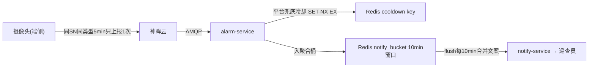
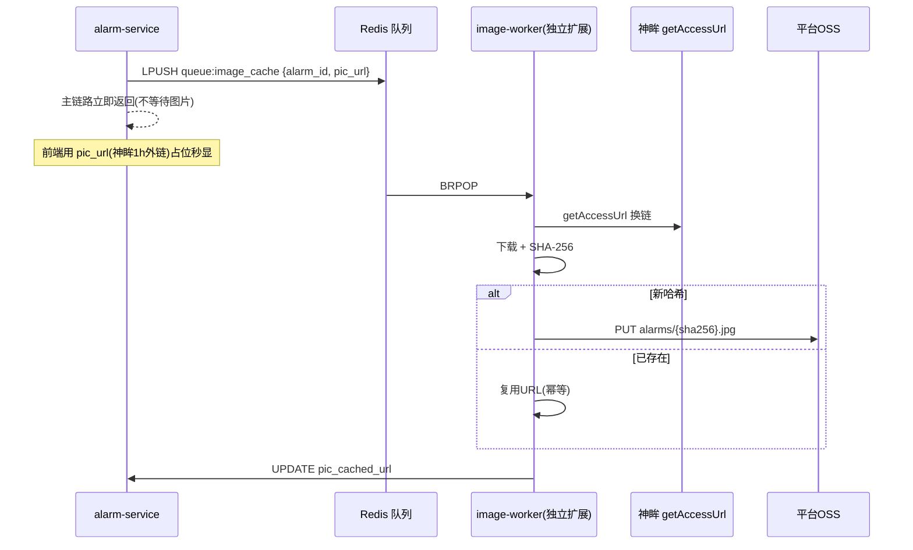
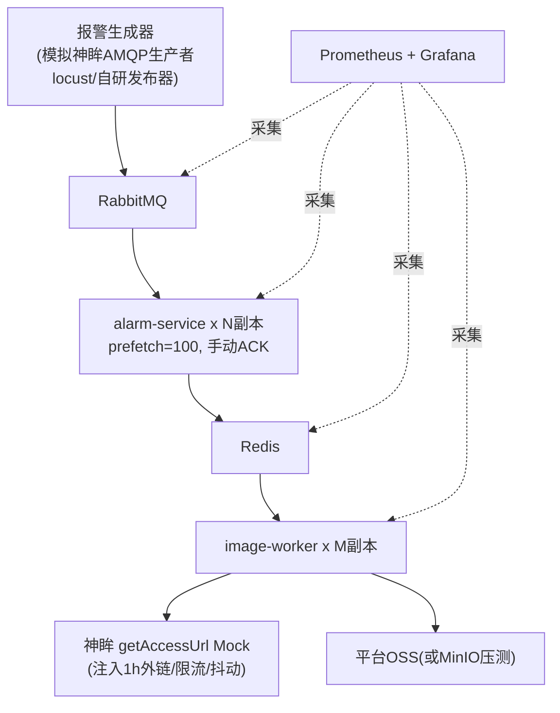

# 慧眼建安 WiseEye-JA · 评审改进项落地设计（P0/P1）

**文档定位**：面向研发人员的系统设计文档 · C 系列之 04
**版本**：v1.0 · 2026-06-22
**来源**：07_多角色专业评审报告.md「综合结论」P0/P1 改进项

> 每条改进项给出：问题 → 设计 → 数据结构/算法 → 验收口径。

---

## 一、P0 改进项（MVP 上线前必须解决）

### P0-1 报警冷却机制（端侧 5min 去重 + 平台 10min 批量聚合）

**问题**：7000 路若每路日触发多次，巡查员被报警轰炸（监管科长、巡查员核心痛点）。

**双层设计**：



#### 第 1 层：端侧设备级去重（5 分钟）
同一摄像头（SN）同一违规类型（AlarmType）5 分钟内只上报一次；冷却期内设备端仍语音播报，但不重复上传事件（SRD 场景 A-1）。

#### 第 2 层：平台兜底冷却（Redis SET NX EX）
防设备端冷却失效刷量。

- **Redis key**：`cooldown:{sn}:{alarm_type}`
- **算法**：`SET cooldown:{sn}:{type} 1 NX EX <ttl>` 原子操作。返回成功 = 首次放行并推送；返回 nil = 冷却期内，仍落库（`notify_suppressed=TRUE`）但不推送。
- **TTL**：默认 300s，从配置中心读取，可被误报闭环（P1-1）临时拉长。

```python
ttl = await get_cooldown_ttl(sn, alarm_type)   # 默认 300, 见 P1-1 覆盖
is_new = await redis.set(f"cooldown:{sn}:{alarm_type}", 1, nx=True, ex=ttl)
# is_new=True → 推送; False → 落库不推送
```

#### 第 3 层：平台聚合推送（10 分钟批量）
按工地维度 10 分钟窗口聚合，合并为一条通知，减少轰炸。

- **聚合桶 key**：`notify_bucket:{site_id}:{window}`，window = 时间向下取整到 10 分钟（如 `202606220810`）。
- **写入**：`RPUSH notify_bucket:{site}:{window} {alarm_id,alarm_type,inspector_id}`，`EXPIRE 660`（11min，留 1min 给 flush）。
- **flush 算法**（每 10min 定时任务）：`SCAN notify_bucket:*` → 按巡查员分组 → 按 alarm_type 汇总数量 → 合并文案推送 → `DEL` 桶。

```python
async def flush_aggregated_notifications():
    async for key in redis.scan_iter("notify_bucket:*"):
        items = [json.loads(r) for r in await redis.lrange(key, 0, -1)]
        await redis.delete(key)
        for inspector_id, group in groupby_inspector(items):
            type_counts = count_by_type(group)        # {20001:5, 20002:1}
            summary = "；".join(f"{label(t)} {n} 条" for t, n in type_counts.items())
            await wx_notify.send(openid_of(inspector_id),
                title=f"【{site_name}】安全报警汇总",
                body=f"过去10分钟：{summary}，请尽快处理")
```

**效果（评审估算）**：每路日 3 次原始报警，冷却后推送量压缩至约 400-600 条/天，科室可承受。

**验收口径**：同 SN 同类型 5min 内多次触发只产生 1 条推送；10min 内同工地多条报警合并为 1 条微信通知；冷却期内事件仍完整落库。

---

### P0-2 异步 image-worker（队列解耦 + SHA-256 幂等 + 1h 外链占位）

**问题**：早高峰图片「换链+下载+上传」I/O 重，若同步会阻塞报警落库主链路。

**设计**：



- **解耦**：alarm-service 只 `LPUSH` 入队即返回，与图片处理完全分离；image-worker 独立进程，可按队列长度水平扩展。
- **SHA-256 幂等**（P1 幂等/BIM 专家诉求）：下载后算内容哈希，`SISMEMBER img:hashes` 命中则复用，否则上传并 `SADD`。Redis 重复投递不会重复存储。
- **占位秒显**：`pic_cached_url` 为空时前端用神眸 1h 外链 `pic_url` 即时显示，缓存完成后切平台 CDN 长期链接（满足 ≤3s 加载 + ≥6 个月留存）。
- **重试/死信**：失败入 `queue:image_cache_retry`，延迟回灌；超 N 次进 `queue:image_cache_dead` 告警。

**数据结构**：`alarm_events.pic_url`（神眸1h外链）/ `pic_cached_url`（平台长期）/ `pic_sha256`（去重指纹）；Redis `queue:image_cache`、`img:hashes`、`img:hash2url`。

**验收口径**：报警落库不被图片处理阻塞；同一图片重复投递只存一份；前端首屏用神眸外链占位、后台异步替换为平台链接。

---

### P0-3 7000 路并发压测方案（早高峰 08:00-09:00 全量场景）

**问题**：7000 路并发波峰下 RabbitMQ + image-worker 是否丢消息缺数据（BIM 专家）。

**压测目标**：模拟早班 08:00-09:00 全量报警，验证「不丢消息 + 时延达标 + 不阻塞」。

#### 场景建模
- 设备：7000 路。早高峰每路触发频率上调（如每路 1-2 min 一次工地行为报警）。
- 峰值速率：按 SRD「1000 条/分钟」并上探至 2-3 倍（约 2000-3000 条/分钟）做余量验证。
- 持续时长：60 分钟（覆盖整个早高峰窗口）。

#### 压测架构



#### 关键指标与判据

| 指标 | 采集点 | 通过判据 |
|------|--------|---------|
| 消息零丢失 | 生产计数 vs `alarm_events` 落库计数（去重后）+ 队列残留 | 生产=落库+合理去重，无未 ACK 丢失 |
| 端到端时延 | 生产时间戳 → 推送触发时间戳 | P95 ≤ 30s（SRD） |
| RabbitMQ 堆积 | queue depth | 高峰可堆积但能在窗口内消化，无持续单调增长 |
| image-worker 滞后 | `queue:image_cache` 长度 | 峰值后能回落，重试队列不雪崩 |
| 图片加载 | 前端占位命中率 | 占位秒显，无大面积空图 |
| 资源 | CPU/内存/DB 连接池 | 无 OOM、无连接耗尽 |

#### 不丢消息验证手段
1. RabbitMQ 队列 `durable=True` + 消息持久化 + 手动 ACK；异常 `requeue=True`。
2. 对账脚本：压测结束比对「生产总数 = 落库去重数 + cooldown 抑制数 + 队列残留数」，差值为 0。
3. 故意 kill 一个 alarm-service 副本，验证未 ACK 消息被其他副本重新消费，不丢失。
4. image-worker 注入神眸接口超时/抖动，验证失败入重试队列、最终一致。

#### 工具
- 生产者：自研 AMQP 发布器（贴合 `IntelligentAlarmV2` 报文）或 k6/locust 驱动。
- 神眸侧：Mock `getAccessUrl`、`device/status`，注入限流与延迟。
- 观测：Prometheus + Grafana + RabbitMQ management plugin。

**验收口径**：60min 早高峰全量压测后，消息对账零丢失、P95 时延 ≤30s、队列峰后回落、无 OOM。

---

## 二、P1 改进项（上线后 1 个月内）

### P1-1 误报标记 → 冷却延长 反馈闭环

**问题**：误报标记若不影响推送规则，巡查员会觉得反馈无意义而停止认真标记。

**设计**：同一 `(sn, event_type)` 累计被标记误报达阈值（默认 3 次）→ 该类型冷却 TTL 临时上调（默认 1800s/30min），并将误报截图入困难样本池反哺算法。

- **计数 key**：`misjudge_count:{sn}:{event_type}`（`INCR` + `EXPIRE` 滚动窗口，如 7 天）。
- **覆盖落库**：`cooldown_overrides(sn,event_type,ttl_seconds,reason='MISJUDGE_3_TIMES',expires_at)`。
- **生效**：alarm-service 的 `get_cooldown_ttl()` 优先读 `cooldown_overrides`，否则用配置中心默认值。

```python
async def on_misjudge(alarm_id):
    a = await db.fetchrow("SELECT sn,event_type,pic_url FROM alarm_events WHERE id=$1", alarm_id)
    await db.execute("UPDATE alarm_events SET confirm_status='MISJUDGE' WHERE id=$1", alarm_id)
    await db.execute("""INSERT INTO misjudge_samples(alarm_id,sn,event_type,pic_url)
                        VALUES($1,$2,$3,$4)""", alarm_id, a["sn"], a["event_type"], a["pic_url"])
    cnt = await redis.incr(f"misjudge_count:{a['sn']}:{a['event_type']}")
    await redis.expire(f"misjudge_count:{a['sn']}:{a['event_type']}", 7*86400)
    if cnt >= await cfg("misjudge.threshold", 3):
        ttl = await cfg("cooldown.misjudge_ttl", 1800)
        await db.execute("""INSERT INTO cooldown_overrides(sn,event_type,ttl_seconds,reason,expires_at)
            VALUES($1,$2,$3,'MISJUDGE_3_TIMES',NOW()+INTERVAL '7 days')
            ON CONFLICT(sn,event_type) DO UPDATE SET ttl_seconds=$3, expires_at=NOW()+INTERVAL '7 days'""",
            a["sn"], a["event_type"], ttl)
```

**验收口径**：同摄像头同类型连续标记 3 次误报后，该类型冷却自动延长至 30min；误报截图进入困难样本池。

---

### P1-2 工地负责人申诉功能

**问题**：误报频繁会引发施工企业抵触（项目经理）。

**设计**：工地负责人小程序对误报记录提交申诉 → 后端建申诉单 → 7 工作日内人工复核；申诉成功的记录不纳入风险评分（risk-service 计算时排除 `appeal_status='APPROVED'`）。新增 `appeals` 表（alarm_id、reason、status、reviewed_by、reviewed_at）。

---

### P1-3 数据库复合索引 (camera_id + event_type + created_at)

**问题**：7000 路日增数十万行，热点查询性能恶化。

**设计**：报警表按月 RANGE 分区，建复合索引（详见 01_后端设计.md 7.1）：

```sql
CREATE INDEX idx_alarm_camera_type_time
    ON alarm_events(sn, event_type, alarm_time DESC);   -- sn 即 camera_id
```

覆盖「单摄像头某类型近期报警」（误报计数、详情页关联信息、算法误报率分析）。配合 `idx_alarm_site_time`、`idx_alarm_status`。验收：关键查询 `EXPLAIN ANALYZE` 命中索引且只扫当月分区。

---

### P1-4 摄像头在线率监控（离线 2h 通知街道联系人）

**问题**：设备离线无人知、无报修链路（街道城建办）。

**设计**：device-service 每 5min 轮询神眸 `device/status` 更新在线状态；扫描「离线 > 2h 且未通知」设备 → 推送对应街道 `contact_phone`/小程序 → 写 `offline_notified_at` 防重复（实现见 03_神眸接口对接.md 第 4 节）。Web 管理端「摄像头在线率」看板按街道汇总。

**验收口径**：设备离线超 2h 自动通知街道联系人一次，恢复后再次离线可再通知。

---

### P1-5 AI 证据链（前后 30 秒视频片段）

**问题**：单张截图证明力弱于连续视频（注册安全工程师）。

**设计**：确认违规时（或证据链接口被访问时）调神眸 `media/vod/start` 截取报警时间点前后 30s 片段，回写 `alarm_events.video_clip_url`。证据链 = 截图 + 前后 30s 视频 + 时间戳 + 巡查员确认（可叠加电子签章/时间戳满足执法要求）。接口：`GET /api/v1/alarms/{id}/evidence`。

---

### P1-6 运营参数配置中心（数据库配置表 + Web 可调）

**问题**：冷却 5min、聚合 10min 等硬编码，调优需重部署（BIM 专家）。

**设计**：`system_configs(key, value JSONB, scope, scope_id, ...)` 存全部运营参数；Web「系统管理→运营参数配置中心」可视化编辑（仅管理员，写 audit_logs）；变更经 Redis pub/sub 通知各服务热加载，无需重启。

| key | 默认 | 含义 |
|-----|------|------|
| cooldown.default_ttl | 300 | 平台兜底冷却秒数 |
| cooldown.misjudge_ttl | 1800 | 误报闭环延长后冷却 |
| notify.aggregate_window | 600 | 聚合窗口秒数 |
| silent.start / silent.end | 22 / 6 | 静音时段 |
| sla.normal / sla.critical | 1800 / 600 | 确认 SLA 秒数 |
| gps.threshold_m | 50 | 班前会签到 GPS 阈值 |

---

### P1-补 GB/T 28181 视频网关层预留

**问题**：对接区块数据中心/雪亮工程的合规要求（NFR-06、住建局处长）。

**设计**：架构预留独立「视频网关层」，将神眸 RTSP 流转码为 GB/T 28181-2022 国标输出（SIP 信令 + PS/RTP 媒体），向区级平台注册级联。一期仅占位（架构图保留该层、预留 `/api/v1/gb28181/*` 接口与配置），二期落地。不影响一期主链路。


---

## 三、改进项落地映射表

| 编号 | 改进项 | 落点（文档/数据结构/服务） | 状态 |
|------|-------|--------------------------|------|
| P0-1 | 报警冷却（5min+10min聚合） | alarm-service `cooldown:{sn}:{type}` / notify_bucket | 已设计 |
| P0-2 | 异步 image-worker + SHA-256 幂等 | image-worker / queue:image_cache / pic_sha256 | 已设计 |
| P0-3 | 7000 路早高峰压测不丢消息 | 压测方案 + 对账脚本 + RabbitMQ durable/ACK | 已设计 |
| P1-1 | 误报→冷却延长闭环 | confirm-service / cooldown_overrides / misjudge_samples | 已设计 |
| P1-2 | 工地负责人申诉 | 工地小程序 / appeals 表 / risk 排除 | 已设计 |
| P1-3 | 复合索引 sn+event_type+time | idx_alarm_camera_type_time + 月分区 | 已设计 |
| P1-4 | 在线率监控离线2h通知 | device-service / device/status / offline_notified_at | 已设计 |
| P1-5 | AI 证据链前后30s视频 | media/vod/start / video_clip_url / evidence API | 已设计 |
| P1-6 | 运营参数配置中心 | system_configs + Web + Redis pub/sub | 已设计 |
| P1-补 | GB/T 28181 网关预留 | 视频网关层 + gb28181 接口占位 | 已预留 |

---

*文档结束 · 慧眼建安 WiseEye-JA 评审改进项落地设计 v1.0*
